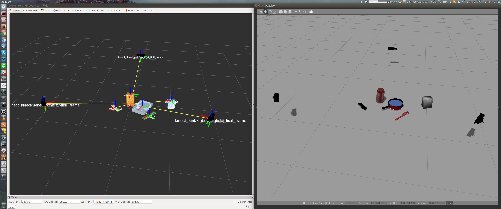

# 複数のKinectであそぶやつ [](https://travis-ci.org/Ry0/multi_kinect)
## インストール 

```bash
cd <catkin_ws>/src
git clone https://github.com/Ry0/multi_kinect.git
cd ..
rosdep install -i --from-paths src
catkin_make
```

## launch
### 3つのKinectから得られた点群をmerge

```bash
roslaunch multi_kinect_gazebo multi_kinectv2_gazebo.launch
roslaunch multi_kinect_merger multi_kinect_merger.launch
```


### clustering

```bash
roslaunch multi_kinect_gazebo multi_kinectv2_gazebo.launch
roslaunch multi_kinect_merger two_kinect_merger.launch
rosrun multi_kinect_euclidean_clust euclidean_cluster_node
```

